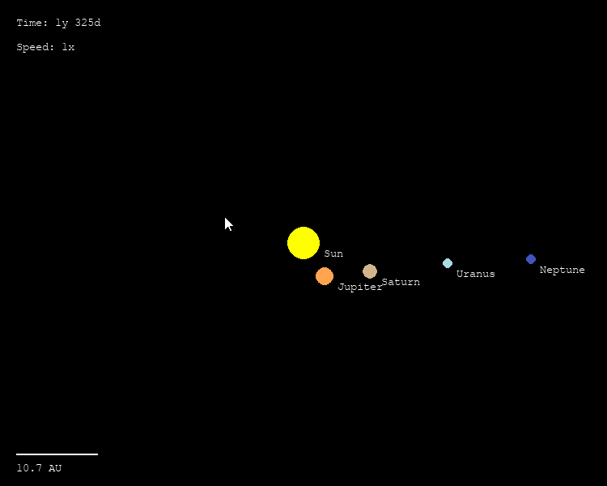
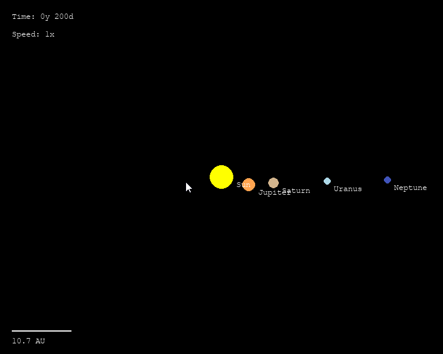
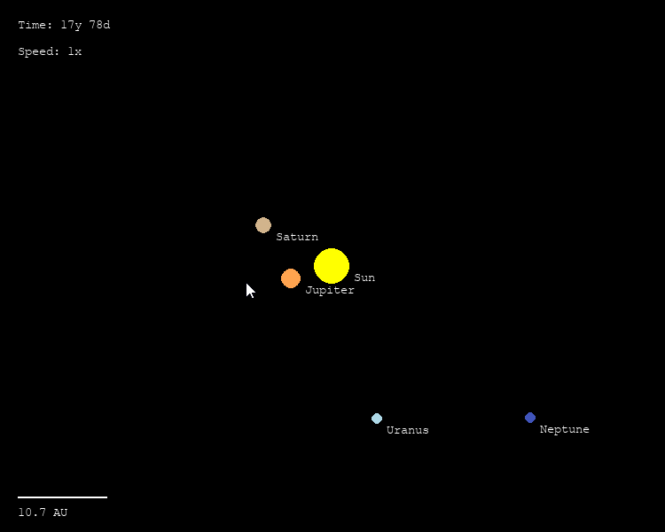

# 2D Planet Simulator

A real-time 2D N-body orbital simulator built in Python using pygame and numpy. The outer planets of the solar system orbit the Sun under real Newtonian gravity, driven by a Velocity Verlet integrator in AU/solar mass/year units. A time multiplier lets you watch decades of orbital motion in seconds.

## Repository Structure
```
planet_sim/
├── config.py     — constants: G, planet data, display settings, time scale
├── physics.py    — Body class, N-body gravity, Velocity Verlet integrator
├── renderer.py   — pygame drawing: Sun, planets, orbit trails, HUD, scale bar
└── main.py       — game loop, input handling, time control
```

## Physics

### N-body gravity
Every body exerts a gravitational pull on every other body simultaneously. For each unique pair (i, j), the gravitational acceleration is computed as:

$$a = \frac{G \cdot M}{r^2}$$

And applied in opposite directions using Newton's third law:

$$\vec{a}_i \ {+}{=} \ a \cdot M_j \cdot \hat{u}$$
$$\vec{a}_j \ {-}{=} \ a \cdot M_i \cdot \hat{u}$$

With 5 bodies (Sun + 4 planets) this gives 10 unique pairs per step — trivially fast.

### Velocity Verlet integrator
The integrator is second-order accurate and conserves energy far better than Euler. Each timestep runs in the following sequence:

$$\vec{r}(t + \Delta t) = \vec{r}(t) + \vec{v}(t)\Delta t + \frac{1}{2}\vec{a}(t)\Delta t^2$$

$$\vec{v}(t + \Delta t) = \vec{v}(t) + \frac{1}{2}\left[\vec{a}(t) + \vec{a}(t + \Delta t)\right]\Delta t$$

Forces are recomputed between the two half-steps so the velocity update uses the average of old and new accelerations.

### Unit system
All quantities are expressed in AU, solar masses, and years. This makes the gravitational constant:

$$G = 4\pi^2 \quad \text{AU}^3 / (\text{solar mass} \cdot \text{year}^2)$$

Avoiding the tiny/huge SI numbers that cause floating point issues. Initial orbital velocities are computed from the exact circular orbit formula:

$$v = \frac{2\pi}{\sqrt{r}}$$

guaranteeing stable orbits from the first timestep.

## Bodies

| Body    | Mass (solar masses) | Orbital radius (AU) |
|---------|--------------------|--------------------|
| Sun     | 1.0                | 0.0 (fixed)        |
| Jupiter | 9.55 × 10⁻⁴        | 5.203              |
| Saturn  | 2.86 × 10⁻⁴        | 9.537              |
| Uranus  | 4.37 × 10⁻⁵        | 19.19              |
| Neptune | 5.15 × 10⁻⁵        | 30.07              |

## Stack

| Area      | Library        |
|-----------|----------------|
| Rendering | pygame 2.6.1   |
| Numerics  | numpy          |
| Core      | Python 3.13 standard library |

## How to Run

Requirements: Python 3.10+, pygame, numpy

Install dependencies:
```
pip install pygame numpy
```

Run the simulator:
```
python main.py
```

A 750×600 window opens with the Sun fixed at center and the outer planets orbiting around it. Use the controls below to adjust the simulation speed.

## Controls

| Input    | Action                        |
|----------|-------------------------------|
| ↑        | Increase time multiplier      |
| ↓        | Decrease time multiplier      |
| Space    | Pause / unpause               |
| R        | Reset to initial conditions   |
| Escape   | Quit                          |

## Demo

Pausing and unpausing the simulation:



Adjusting the time multiplier with ↑ / ↓:



Resetting to initial conditions with R:



## Tuning

All physics constants live in `config.py` and are the intended way to experiment:

| Constant     | Effect                                          |
|--------------|-------------------------------------------------|
| `dt`         | Timestep in years — reduce if orbits go unstable |
| `speed_steps`| Ladder of time multipliers available via ↑/↓   |
| `trail_length`| Number of past positions drawn per planet      |
| `scale`      | Pixels per AU — controls zoom level            |

## Notes

Built and tested on Python 3.13, pygame 2.6.1, Windows 10. Written entirely from scratch with no starter code. All physics implemented manually — no physics engine used.
